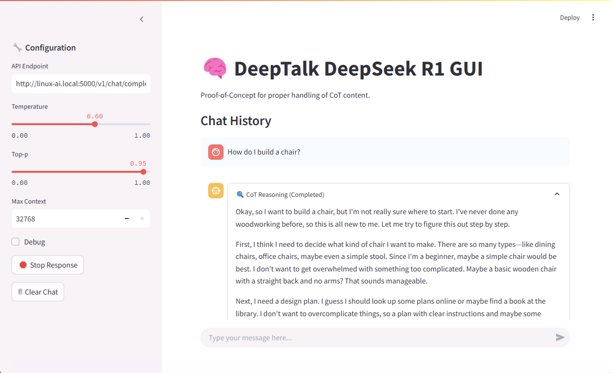
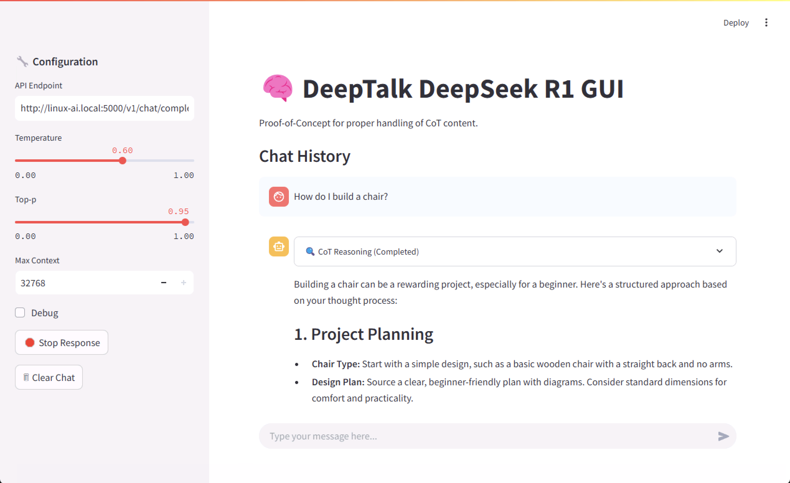

# 🧠 DeepTalk DeepSeek-R1 GUI

A Streamlit-based Proof-of-Concept (PoC) for inferencing **DeepSeek-R1** and **Qwen-QwQ** models via the OpenAI API.  
This GUI enables **Chain-of-Thought (CoT) handling**, ensuring proper contextual reasoning for LLM interactions while preventing stale CoT data from polluting session memory.

---

## 📖 Introduction

DeepSeek-R1 and Qwen-QwQ are "reasoning" models that begins with **Chain-of-Thought (CoT) reasoning**, encapsulated within `<think></think>` tags. This mechanism allows the model to break down complex problems and generate structured responses.

### **The Problem: Uncontrolled CoT Context Growth**
Most LLM clients currently **retain and resend CoT outputs** in session history, leading to:

1. **Context Window Bloat** – Unnecessary CoT data rapidly consumes available tokens.
2. **Irrelevant CoT Carryover** – Old reasoning outputs persist and interfere with new queries.
3. **Redundant Processing** – The model repeatedly processes stale CoT, degrading response quality.

### **The Solution: Controlled CoT Retention**
This GUI **isolates CoT reasoning during generation**, ensuring:

✔ CoT reasoning is **used for inference but not stored** in session memory.  
✔ CoT explanations remain **visible for review** but are excluded from future prompts.  
✔ The conversation buffer is **optimized** for better model efficiency and coherence.

---

## 🚀 Features

- **📡 Streamlit UI** – Intuitive interface for interacting with DeepSeek-R1 and Qwen-QwQ.
- **🧠 CoT Segmentation** – Extracts `<think></think>` reasoning while **preventing stale CoT retention**.
- **📡 Real-time Streaming** – Displays LLM responses **as they are generated**.
- **📌 Live CoT View** – CoT reasoning is displayed **separately in real-time** but excluded from history.
- **📋 Optimized Context Buffer** – Ensures **only** the final answers are retained in session history.
- **🐞 Debugging & Logging Tools**:
  - **Debug Mode:** Shows **real-time API payloads, CoT extraction, and model responses** for troubleshooting.
  - **Structured Logging:** Saves **full user queries, CoT reasoning, and responses** in session logs.
- **💾 Session Log Export** – Allows easy export of chat logs with CoT insights.
- **⚡ OpenAI API** – For inferencing **on-premises and hosted instances of DeepSeek-R1**.

---

## 🖥 Screenshots

### **CoT Reasoning in Action**


### **Collapsed CoT with LLM Output**


---

## 📦 Installation

Install the required dependencies:

```sh
pip install streamlit requests
```

---

## 🏃 Usage

Run the Streamlit DeepTalk interface:

```sh
streamlit run deeptalk.py
```

Specify your OpenAI-compatible API endpoint in the UI.

---

## 🔍 How CoT Handling Works

1. **User submits a prompt.**  
2. **Model generates a response with CoT reasoning.**  
3. **The GUI captures and streams CoT reasoning separately.**  
4. **Once completed, CoT is removed from context memory.**  
5. **Only the final response is stored in chat history.**  

💡 *This method ensures that CoT reasoning improves responses without polluting future prompts.*

---

## 📜 License

Licensed under the **Apache 2.0 License**.  
See [LICENSE](LICENSE) for details.

---

## 🤝 Contributing

Contributions are welcome!  
Fork the repo, make changes, and submit a pull request.

---

## 🔗 More Information

For further details and contributions, visit:  
[🔗 GitHub Repository](https://github.com/AightBits/DeepTalk)
